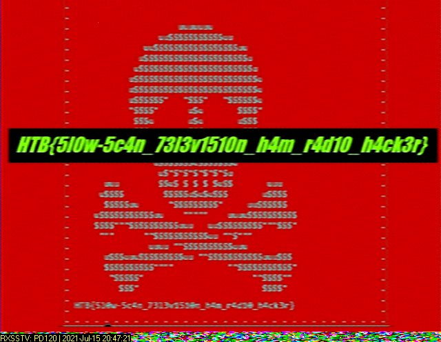

# Signals
Author: [willwam845](https://app.hackthebox.eu/users/219091)  
Category: Hardware  
Points: 10

## Challenge Description
> Some amateur radio hackers captured a strange signal from space. A first analysis indicates similarities with signals transmitted by the ISS. Can you decode the signal and get the information?

### Downloads
[Signal.wav](./Signal.wav)

## Approach
Between the challenge description and the first 5 seconds of the sound file, I'd assume it's a [SSTV transmit](https://en.wikipedia.org/wiki/Slow-scan_television).  
We can use [RX-SSTV](https://www.qsl.net/on6mu/rxsstv.htm) to decode this:  

### Flag
`HTB{5l0w-5c4n_73l3v1510n_h4m_r4d10_h4ck3r}`