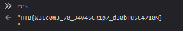

# Canvas

Author: [felamos](https://app.hackthebox.eu/users/27390)
Category: Misc
Points: 20

## Challenge Description
> We want to update our website but we are unable to because the developer who coded this left today. Can you take a look?

### Downloads
Zipped folder containing [c](./c)

## Approach
[`index.html`](./c/index.html) is a log in page. [`dashboard.html`](./c/dashboard.html) is a false flag. I decided to take a look at the [JavaScript](./c/js/login.js) to see if it would help.  
Using [beautifier.io](https://beautifier.io/) I made the JavaScript more readable.  
I realized the last line is never used:
```js
var res = String['\x66\x72\x6f\x6d\x43\x68\x61\x72\x43\x6f\x64\x65'](0x48, 0x54, 0x42, 0x7b, 0x57, 0x33, 0x4c, 0x63, 0x30, 0x6d, 0x33, 0x5f, 0x37, 0x30, 0x5f, 0x4a, 0x34, 0x56, 0x34, 0x35, 0x43, 0x52, 0x31, 0x70, 0x37, 0x5f, 0x64, 0x33, 0x30, 0x62, 0x46, 0x75, 0x35, 0x43, 0x34, 0x37, 0x31, 0x30, 0x4e, 0x7d, 0xa);
```
I opened [`index.html`](./c/index.html) in the browser, inspected, selected the console option, and typed in "`res`" (calling the variable's value)


### Flag
`HTB{W3Lc0m3_70_J4V45CR1p7_d30bFu5C4710N}`