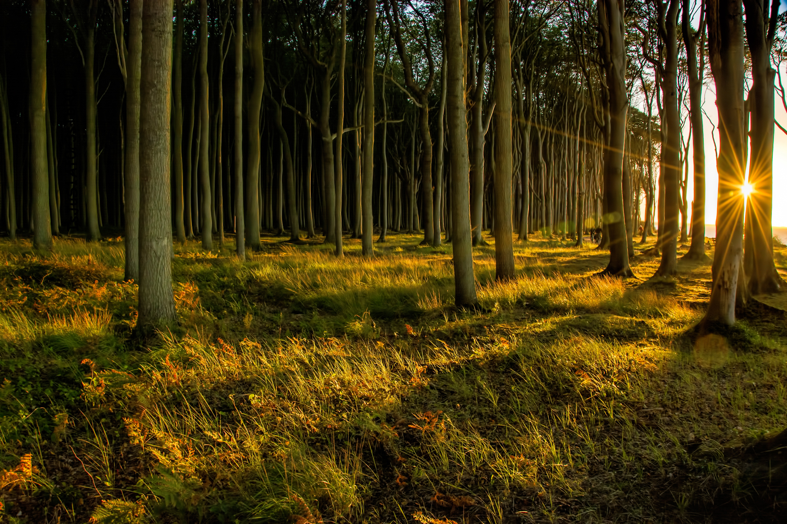

# Forest
Author: [pwn4magic](https://app.hackthebox.eu/users/119)  
Category: Stego  
Points: 40

## Challenge Description
> Explore the forest and capture the flag!



## Approach
First, I tried running `strings` but nothing interesting came up.  
The next thing I did ws browse through [`forest.jpg`](./forest.jpg) with [stegsolve](https://github.com/eugenekolo/sec-tools/tree/master/stego/stegsolve/stegsolve). Several planes and maps (red 0, green 0, blue 0, and random colour maps) revealed some text that looked like "IsJuS1Af0r3sTbR0".  
Since the image is a jpg, [steghide](http://steghide.sourceforge.net/index.php) might be able to extract information from it. I used "IsJuS1Af0r3sTbR0" as the password.
```bash
$ steghide info forest.jpg
"forest.jpg":
  format: jpeg
  capacity: 134.9 KB
Try to get information about embedded data ? (y/n) y
Enter passphrase:
  embedded file "nothinghere.txt":
    size: 428.0 Byte
    encrypted: rijndael-128, cbc
    compressed: yes
```
```bash
$ steghide extract -sf forest.jpg
Enter passphrase:
wrote extracted data to "nothinghere.txt".
```
[`nothinghere.txt`](./nothinghere.txt) contains encrypted information. It was encrypted with [ROT13](https://en.wikipedia.org/wiki/ROT13):
```text
The forest is a complex ecosystem consisting mainly of trees that buffer the earth and support a myriad of life forms. The trees help create a special environment which, in turn, affects the kinds of animals and plants that can exist in the forest. Trees are an important component of the environment. They clean the air, cool it on hot days, conserve heat at night, and act as excellent sound absorbers. HTB{AmAz1nGsKilLzZBr0}
```

### Flag
`HTB{AmAz1nGsKilLzZBr0}`